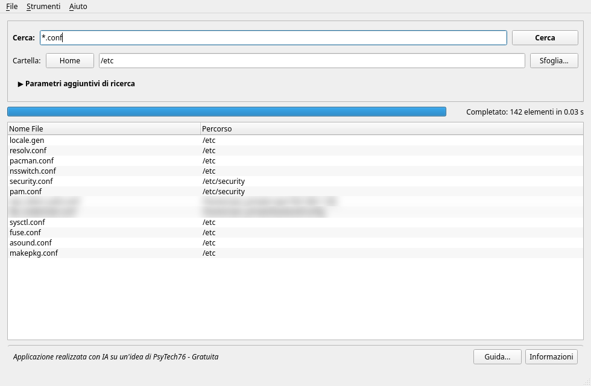
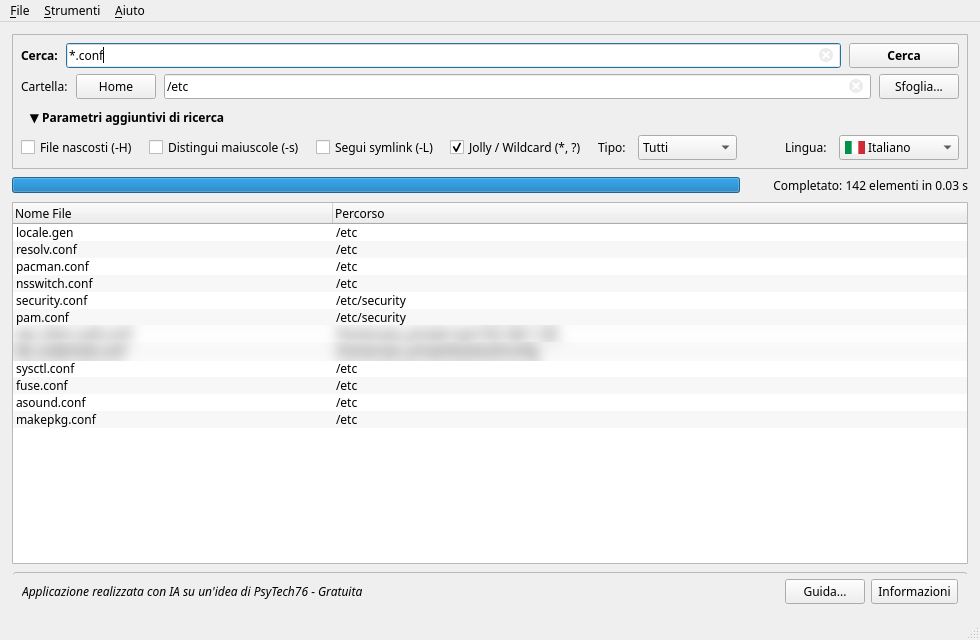
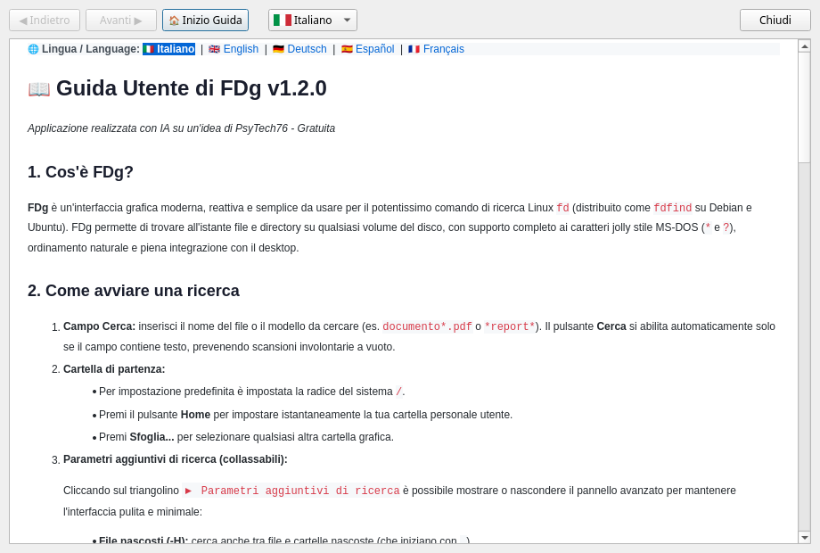
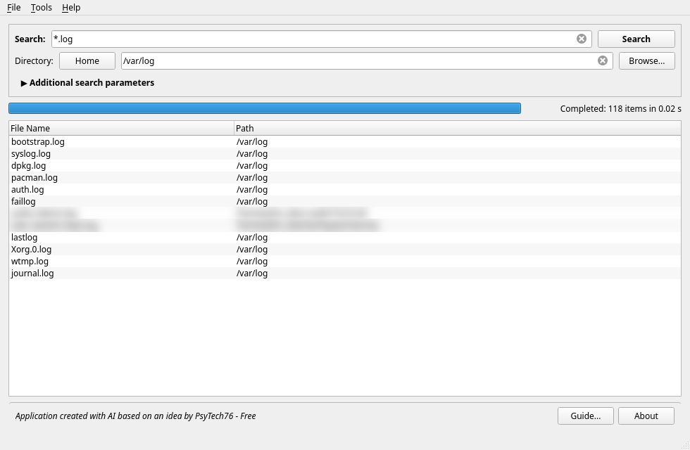
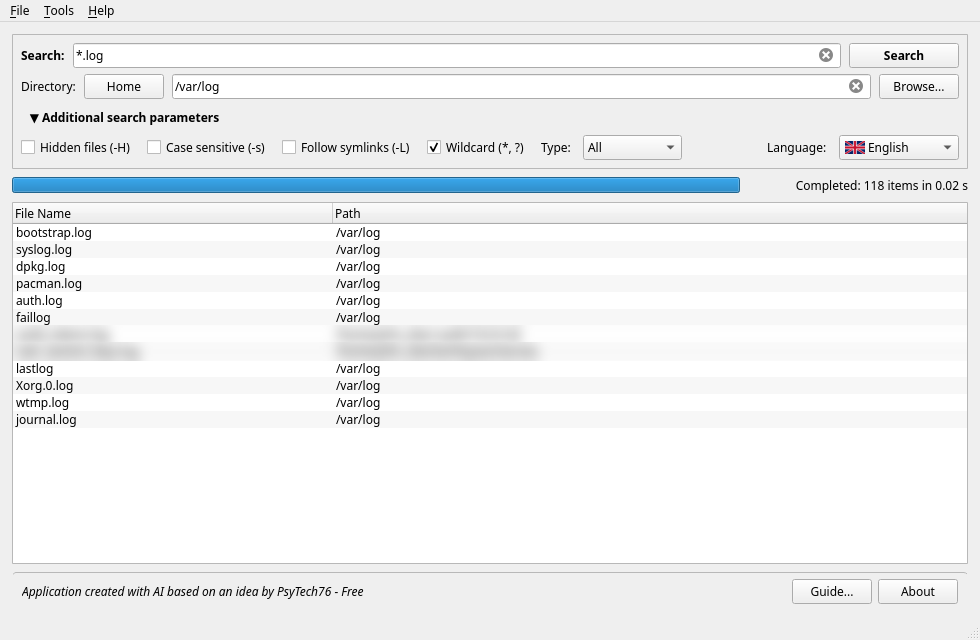
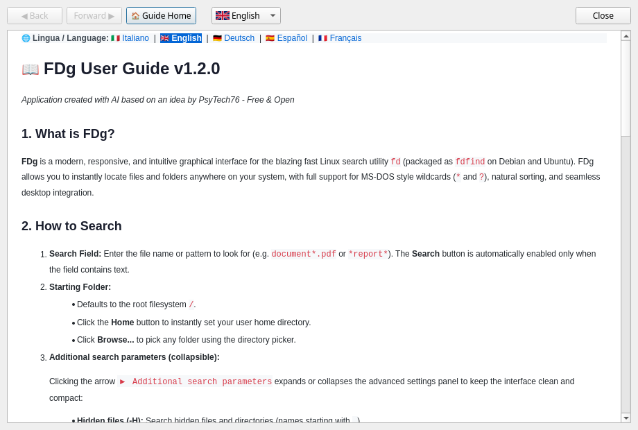

# FDg (v1.2.0)

[](LICENSE)
[-green.svg)]()
[]()
[]()
[]()

> **🇮🇹 Italiano:** Applicazione concepita e ideata da **PsyTech76**, interamente ingegnerizzata e sviluppata con l'ausilio di **Intelligenza Artificiale** (Google DeepMind - Advanced Agentic Coding). Gratuita e Open Source per la comunità GNU/Linux.  
> **🇬🇧 English:** Application conceived and designed by **PsyTech76**, entirely engineered and developed using **Artificial Intelligence** (Google DeepMind - Advanced Agentic Coding). Free and Open Source software for the GNU/Linux community.

---

## 🇮🇹 INDICE DEI CONTENUTI (Italiano)
1. [Cos'è FDg](#-cosè-fdg)
2. [Caratteristiche Principali](#-caratteristiche-principali)
3. [Schermate dell'Applicazione](#-schermate-dellapplicazione)
4. [Guida all'Uso Lato Utente](#-guida-alluso-lato-utente)
5. [Integrazione di Sistema e Barra delle Applicazioni](#-integrazione-di-sistema-e-barra-delle-applicazioni)
6. [Verifica e Installazione Automatica del Motore 'fd'](#-verifica-e-installazione-automatica-del-motore-fd)
7. [Scorciatoie da Tastiera](#-scorciatoie-da-tastiera)
8. [Informazioni sulla Distribuzione (AppImage)](#-informazioni-sulla-distribuzione-appimage)
9. [Compilazione dai Sorgenti](#-compilazione-dai-sorgenti)
10. [Struttura del Progetto](#-struttura-del-progetto)
11. [Crediti e Licenza](#-crediti-e-licenza)

---

## 🇬🇧 TABLE OF CONTENTS (English)
1. [What is FDg?](#-what-is-fdg)
2. [Key Features](#-key-features)
3. [Application Screenshots](#-application-screenshots)
4. [User Guide & How It Works](#-user-guide--how-it-works)
5. [System & Taskbar Desktop Integration](#-system--taskbar-desktop-integration)
6. [Automated Engine Verification & Installation](#-automated-engine-verification--installation)
7. [Keyboard Shortcuts](#-keyboard-shortcuts)
8. [Distribution & AppImage Packaging](#-distribution--appimage-packaging)
9. [Building from Source](#-building-from-source)
10. [Project Architecture](#-project-architecture)
11. [Credits & License](#-credits--license)

---

# 🇮🇹 Sezione Italiana

## 🔍 Cos'è FDg?

**FDg** è un'interfaccia grafica moderna, reattiva, pulita ed intuitiva scritta in **C++ / Qt 6** per il potentissimo motore di ricerca file da terminale **`fd`** (distribuito come `fd-find` su Debian e Ubuntu).

Mentre la maggior parte dei cercatori grafici tradizionali risulta lenta o appesantita da indicizzazioni continue in background, FDg sfrutta la straordinaria velocità parallela di `fd` (scritto in Rust) per scandire il filesystem istantaneamente in sola lettura, offrendo:
- Ricerca istantanea senza bisogno di database o demoni in background.
- Supporto completo ai caratteri jolly stile MS-DOS (`*` e `?`).
- Ergonomia ottimizzata per desktop moderni (KDE Plasma, GNOME, XFCE, Cinnamon, MATE).
- Distribuzione universale autonoma in formato **AppImage**.

---

## 🌟 Caratteristiche Principali

- **Velocità Estrema**: Sfrutta la scansione multi-thread di `fd`, trovando file tra milioni di elementi in frazioni di secondo.
- **Caratteri Jolly MS-DOS Nativo (`*` e `?`)**: Ricerche immediate come `*.txt`, `*.*`, `doc*`, `*report*`, `foto?.jpg`.
- **Validazione Intelligente dell'Input**: Il pulsante *Cerca* si attiva unicamente se il campo contiene testo reale, prevenendo scansioni accidentali o non intenzionali a vuoto.
- **Selezione Rapida del Percorso**: Percorso di default impostato sulla radice `/` del disco e pulsante dedicato **Home** (`~`) per circoscrivere la ricerca alla cartella utente con un solo click.
- **Pannello Parametri Collassabile**: Un controllo elegante con triangolino cliccabile (`▶` / `▼`) permette di mostrare o nascondere le opzioni avanzate (file nascosti, case sensitive, symlink, jolly MS-DOS, filtro tipo e selezione lingua), preservando uno stato pulito e minimale.
- **Doppio Click Intelligente e Differenziato**:
  - *Doppio click sul Nome File*: apre immediatamente il file con l'applicazione associata predefinita (VLC, Kate, LibreOffice, Gedit, ecc.).
  - *Doppio click sul Percorso*: apre il gestore file di sistema (Dolphin, Nautilus, Nemo, Thunar) ed **evidenzia/seleziona il file** senza aprirlo.
- **Interruzione Istantanea e Sicura (`SIGKILL`)**: Arresta il processo in background istantaneamente. Poiché `fd` effettua solo letture di metadati, l'interruzione è sicura al 100% per documenti e sistema operativo.
- **Funzione "Nuova Ricerca" (`Ctrl+N`)**: Interrompe scansioni in corso, pulisce il campo query e resetta integralmente la tabella dei risultati.
- **Integrazione Desktop XDG a 1 Click**: Risolve definitivamente il problema delle AppImage sui pannelli di sistema (KDE Plasma/GNOME), installando un lanciatore `.desktop` permanente e icona ad alta risoluzione in `~/.local/share/`.
- **Verifica e Installazione Guidata del Motore**: Riconosce all'avvio e da menu la presenza di `fd` o `fdfind`. Se assente, propone l'installazione automatica multi-distro (Arch Linux, Debian/Ubuntu, Fedora, openSUSE) con autorizzazione nativa PolicyKit (`pkexec`) e log in tempo reale.
- **Guida Utente HTML Multilingua Integrata**: Manuale integrato nell'AppImage in 5 lingue (Italiano, Inglese, Tedesco, Spagnolo, Francese) consultabile con un browser minimale Qt (`QTextBrowser`).
- **Interfaccia Multilingua (i18n)**: Traduzioni native in 5 lingue con icone a bandiera SVG/PNG nitide.
- **Stile Grafico Uniforme e Selettore Temi**: Adotta di default lo stile grafico `Fusion` con palette chiara pulita e definita, assicurando la perfetta corrispondenza visiva con gli screenshot della documentazione su qualsiasi desktop Linux (KDE Plasma, GNOME, XFCE) ed evitando discrepanze da temi scuri di sistema. Dal menu `Strumenti -> Tema` è possibile selezionare a piacere *Chiaro (Predefinito)*, *Scuro* o *Predefinito di Sistema*, con memorizzazione automatica.

---

## 📸 Schermate dell'Applicazione

> [!NOTE]
> Per garantire la massima riservatezza e conformità con le buone pratiche di privacy, eventuali dati sensibili mostrati nelle schermate (nomi utente, indirizzi IP di rete e percorsi privati) sono stati oscurati con sfocatura (*Privacy Blur*).

| 🔍 Schermata Principale (Ricerca Rapida) | ⚙️ Parametri Avanzati di Ricerca Espansi |
| :---: | :---: |
|  |  |
| *Vista essenziale con risultati ordinati e pulsante opzioni compresso* | *Pannello espanso con wildcard, regex, filtri e selettore lingua* |

<br/>

| 📖 Guida Utente HTML Integrata (Browser Offline) |
| :---: |
|  |
| *Manuale d'uso integrato visualizzabile offline con commutazione lingua a 1 click* |

---

## 📖 Guida all'Uso Lato Utente

### Come Eseguire una Ricerca
1. **Nome o Modello del File**: Inserisci il testo da cercare nella casella di ricerca (es. `relazione*.pdf`). Il pulsante **Cerca** si abiliterà automaticamente.
2. **Cartella di Partenza**:
   - Di default è impostata la radice del sistema `/`.
   - Clicca sul pulsante **Home** per impostare la tua cartella personale `~`.
   - Clicca su **Sfoglia...** per selezionare una cartella specifica dal filesystem.
3. **Parametri Aggiuntivi di Ricerca**:
   Clicca su `▶ Parametri aggiuntivi di ricerca` per accedere ai filtri:
   - **File nascosti (-H)**: include file e cartelle che iniziano con `.`.
   - **Distingui maiuscole (-s)**: ricerca sensibile a maiuscole/minuscole.
   - **Segui collegamenti simbolici (-L)**: esplora la destinazione dei symlink.
   - **Usa caratteri jolly (* e ?)**: attiva la compatibilità con i pattern stile DOS/Glob.
   - **Filtro tipo**: limita la ricerca a *Tutti gli elementi*, *Solo file* o *Solo cartelle*.
   - **Selettore lingua**: cambia istantaneamente la lingua dell'interfaccia.
4. Premi il pulsante **Cerca** o il tasto **Invio**.

### Sintassi dei Caratteri Jolly MS-DOS
| Modello | Risultato della Ricerca |
| :--- | :--- |
| `*.txt` | Tutti i file con estensione `.txt` |
| `*.*` | Qualsiasi file dotato di un'estensione |
| `doc*` | File e cartelle che iniziano con `doc` |
| `*bilancio*` | File contenenti la parola `bilancio` nel nome |
| `foto?.png` | Sostituisce un singolo carattere (es. `foto1.png`, `fotoA.png`) |
| `*` | Elenca tutti gli elementi presenti nella cartella selezionata |

### Interazione con i Risultati
- **Ordinamento naturale**: Clicca sulle intestazioni *Nome File* o *Percorso* per ordinare in senso crescente (A-Z, 0-9) o decrescente.
- **Menu Contestuale (Tasto Destro)**:
  - *Apri file*: apre il file con l'applicazione associata.
  - *Mostra nella cartella*: apre il file manager evidenziando l'elemento.
  - *Copia percorso assoluto*: copia il percorso completo negli appunti.
  - *Copia nome file*: copia il solo nome negli appunti.

---

## 🖥️ Integrazione di Sistema e Barra delle Applicazioni

Le applicazioni AppImage risiedono in punti di montaggio temporanei (`/tmp/.mount_XXXXXX/`). Quando un utente tenta di aggiungere un'AppImage in esecuzione alla barra delle applicazioni di KDE Plasma o GNOME, alla chiusura del programma il punto di montaggio scompare e l'icona diventa invisibile o non avviabile.

FDg include una soluzione automatica nativa dal menu **Strumenti**:
- **Integra nel sistema (Menu e Barra)...**: Genera il lanciatore standard `~/.local/share/applications/fdg.desktop` e copia l'icona permanente a 256x256 px in `~/.local/share/icons/fdg.png`. L'applicazione comparirà nel menu delle applicazioni di sistema e potrà essere bloccata stabilmente su dock o barra delle applicazioni.
- **Rimuovi integrazione dal sistema...**: Rileva la presenza del lanciatore e consente una rimozione pulita e istantanea con un click.

---

## ⚙️ Verifica e Installazione Automatica del Motore 'fd'

Per garantire un funzionamento immediato anche a chi non ha ancora familiarità con il terminale Linux:
1. **Controllo all'avvio**: Se `fd` o `fdfind` non è installato sul sistema, FDg avvisa l'utente e propone l'installazione automatica.
2. **Accesso dal menu**: Tramite **Strumenti $\rightarrow$ Verifica o Installa motore 'fd'...**:
   - Se il motore è già installato, il programma ne rileva la versione e conferma che tutte le funzioni sono pronte, **senza avviare alcuna installazione ridondante**.
   - Se assente, propone l'installazione guidata.
3. **Supporto Multi-Distro**: Riconosce dinamicamente il gestore di pacchetti host:
   - Arch Linux / Manjaro / CachyOS (`pacman`)
   - Debian / Ubuntu / Linux Mint (`apt-get`)
   - Fedora / Red Hat (`dnf`)
   - openSUSE (`zypper`)
4. **Autorizzazione Nativa PolicyKit (`pkexec`)**: L'elevazione dei privilegi è gestita dal framework desktop nativo senza alcuna gestione di credenziali da parte dell'applicazione.
5. **Log in tempo reale**: L'output del terminale viene mostrato in diretta in una console con rimozione automatica dei codici ANSI.

---

## ⌨️ Scorciatoie da Tastiera

| Scorciatoia | Funzione |
| :--- | :--- |
| `Ctrl+N` | **Nuova Ricerca**: interrompe scansioni attive, svuota il testo e rimuove tutti i risultati precedenti |
| `Ctrl+Q` | **Chiudi**: esce dall'applicazione |
| `F1` | **Guida**: apre il visualizzatore della documentazione utente |
| `Invio` (sul campo cerca) | Avvia la ricerca |
| `Invio` (sulla tabella risultati) | Apre il file selezionato con l'app predefinita |

---

## 📦 Informazioni sulla Distribuzione (AppImage)

L'AppImage universale di FDg è progettata per la massima portabilità tra le distribuzioni GNU/Linux:
- **Compilazione su base Debian 12 (glibc 2.36)**: garantisce compatibilità immediata con qualsiasi distribuzione moderna (Debian 12+, Ubuntu 22.04+, Arch Linux, Fedora 38+, openSUSE Leap/Tumbleweed).
- **Isolamento dell'Ambiente Host (`cleanEnvironment`)**: Tutte le chiamate ad applicazioni esterne e gestori di file epurano `LD_LIBRARY_PATH` e `QT_PLUGIN_PATH` dell'AppImage, prevenendo conflitti con le librerie di sistema.
- **Browser HTML integrato**: La documentazione in 5 lingue è compilata nelle risorse Qt interne (`resources.qrc`), senza dipendenze pesanti da motori web esterni (risparmiando oltre 150 MB rispetto a Chromium/WebEngine).

### Esecuzione dell'AppImage:
```bash
chmod +x FDg-x86_64.AppImage
./FDg-x86_64.AppImage
```

---

## 🛠️ Compilazione dai Sorgenti

### Requisiti
- Compilatore C++17 o C++20 (`g++` o `clang++`)
- `cmake` >= 3.16
- Moduli `Qt 6` (`qt6-base`, `qt6-tools`)
- Motore di ricerca `fd` (o `fd-find`)

### Istruzioni di Build
```bash
# Clona il repository
git clone https://github.com/PsyTech1976/FDg.git
cd FDg

# Configura e compila
mkdir -p build && cd build
cmake .. -DCMAKE_BUILD_TYPE=Release
make -j$(nproc)

# Esegui l'applicazione
./fdg
```

### Generazione dell'AppImage Universale
La cartella `packaging/` include il Dockerfile Debian 12 e lo script di bundling automatizzato:
```bash
bash packaging/build_all.sh
```

---

## 📂 Struttura del Progetto

```
FDg/
├── CMakeLists.txt              # Configurazione di build CMake per Qt 6
├── README.md                   # Documentazione bilingue (Italiano ed Inglese)
├── SPEC.md                     # Specifiche tecniche e funzionali formali
├── LICENSE                     # Licenza open-source MIT
├── src/                        # Codice sorgente C++ / Qt 6
│   ├── main.cpp                # Punto di ingresso dell'applicazione
│   ├── mainwindow.h/.cpp/.ui   # Finestra principale e logica di ricerca
│   ├── fdrunner.h/.cpp         # Gestore del processo asincrono 'fd' e SIGKILL
│   ├── filemanagerhelper.h/.cpp# Apertura file e isolamento runtime
│   ├── desktopintegrator.h/.cpp# Integrazione desktop XDG (.desktop e icone)
│   ├── dependencyinstaller.h/.cpp# Installazione guidata dipendenze PolicyKit
│   ├── themehelper.h/.cpp      # Gestione stili Fusion (Chiaro/Scuro) e coerenza visiva
│   └── guidedialog.h/.cpp      # Browser minimale HTML multilingua
├── resources/                  # Risorse grafiche e traduzioni compilate
│   ├── resources.qrc           # Qt Resource Collection
│   ├── icons/                  # Icone applicazione e bandiere per le lingue
│   ├── help/                   # Guide utente HTML in 5 lingue (IT, EN, DE, ES, FR)
│   └── translations/           # File binari .qm compilati
├── translations/               # File sorgente di localizzazione Qt (.ts)
├── packaging/                  # Strumenti di pacchettizzazione AppImage
│   ├── build_all.sh            # Script di compilazione universale containerizzato
│   ├── bundle_appimage.py      # Script di estrazione librerie e plugin
│   ├── Dockerfile.debian12     # Container di compilazione per massima compatibilità
│   └── fdg.desktop             # Definizione lanciatore XDG
├── docs/                       # Documentazione tecnica e manuali
│   ├── DOCUMENTAZIONE.md       # Documento tecnico completo
│   ├── FDg-Documentazione.pdf  # Manuale tecnico in formato PDF
│   ├── images/                 # Schermate dell'applicazione per la documentazione
│   ├── create_help_files.py    # Generatore guide HTML multilingua
│   └── generate_pdf.py         # Script Python/Qt per la generazione del PDF
└── tools/                      # Script e tool ausiliari (cattura screenshot, blur privacy)
```

---

## 👤 Crediti e Licenza

- **Ideazione e Requisiti di Progetto**: **PsyTech76**
- **Ingegnerizzazione e Sviluppo**: **Intelligenza Artificiale** (Google DeepMind - Advanced Agentic Coding)
- **Licenza**: [MIT License](LICENSE) - Software gratuito e open source.

---
---

# 🇬🇧 English Section

## 🔍 What is FDg?

**FDg** is a modern, responsive, clean, and intuitive graphical user interface written in **C++ / Qt 6** for the ultra-fast Linux command-line search utility **`fd`** (packaged as `fd-find` on Debian and Ubuntu).

While conventional graphical file search tools are notoriously slow or burdened by continuous background indexing services, FDg leverages the high-performance multi-threaded traversal of `fd` (written in Rust) to scan filesystems on-demand in pure read-only mode, providing:
- Instant searches with zero background indexers or CPU overhead.
- Full native support for MS-DOS wildcard patterns (`*` and `?`).
- Smooth desktop ergonomics tailored for modern environments (KDE Plasma, GNOME, XFCE, Cinnamon, MATE).
- Universal portable distribution via **AppImage**.

---

## 🌟 Key Features

- **Blazing Fast**: Directly utilizes the parallel Rust traversal engine of `fd`, locating files across millions of filesystem entries in milliseconds.
- **Native MS-DOS Wildcard Support (`*` and `?`)**: Search easily with patterns like `*.txt`, `*.*`, `doc*`, `*report*`, `photo?.jpg`.
- **Intelligent Input Validation**: The *Search* button enables dynamically only when non-whitespace query text is entered, avoiding inadvertent root scans.
- **One-Click Directory Selection**: Starts by default at the filesystem root `/` and offers a dedicated **Home** button (`~`) to instantly focus on the user profile.
- **Collapsible Search Parameters Panel**: A compact toggle button (`▶` / `▼`) hides or reveals advanced controls (hidden files, case sensitivity, symlinks, DOS wildcards, file/directory filter, language selector), preserving visual clarity.
- **Smart Dual Double-Click Action**:
  - *Double-click on File Name*: immediately opens the target file with its registered system application (VLC, Kate, LibreOffice, Gedit, image viewer, etc.).
  - *Double-click on Path*: opens the native file manager (Dolphin, Nautilus, Nemo, Thunar) and **highlights/selects the file** without launching it.
- **Instant & Safe Cancellation (`SIGKILL`)**: Halts running search scans instantly. Because `fd` performs strictly read-only filesystem reads, immediate termination is 100% safe for files and system integrity.
- **"New Search" Reset (`Ctrl+N`)**: Cancels running tasks, clears the query field, and completely flushes previous results for a fresh start.
- **One-Click XDG Desktop Integration**: Eliminates the common AppImage taskbar pinning issue on modern Linux desktops by installing a persistent `.desktop` launcher and high-res icon into `~/.local/share/`.
- **Distro-Aware Engine Verification & Installer**: Verifies at startup and on-demand whether `fd` or `fdfind` is installed. If absent, guides the user through automatic installation on Arch Linux, Debian/Ubuntu, Fedora, or openSUSE via native PolicyKit (`pkexec`) with real-time logs.
- **Embedded Multi-Language HTML User Guide**: User manual bundled inside the AppImage in 5 languages (English, Italian, German, Spanish, French), viewable via a built-in lightweight Qt viewer (`QTextBrowser`).
- **Full Localization (i18n)**: UI available in 5 languages with crisp SVG/PNG flag icons.
- **Uniform Visual Styling & Theme Switcher**: Automatically enforces the `Fusion` style with a dedicated crisp light palette by default, ensuring exact visual parity with documentation screenshots regardless of the user's host desktop theme (KDE Plasma, GNOME, XFCE). The `Tools -> Theme` menu lets users switch between *Light (Default)*, *Dark*, and *System Default*, persisted automatically.

---

## 📸 Application Screenshots

> [!NOTE]
> To ensure confidentiality and privacy compliance, sensitive information displayed in the screenshots (such as user names, internal IP addresses, and private configuration paths) has been protected using Gaussian blur (*Privacy Blur*).

| 🔍 Main Search Interface | ⚙️ Advanced Search Parameters Expanded |
| :---: | :---: |
|  |  |
| *Clean interface with sorted results and collapsible options panel collapsed* | *Expanded panel showing wildcards, regex, filters, and language switcher* |

<br/>

| 📖 Embedded HTML User Guide (Offline Browser) |
| :---: |
|  |
| *Self-contained offline documentation browser with one-click language switching* |

---

## 📖 User Guide & How It Works

### Executing a Search
1. **Search Query**: Type the file name or pattern into the query field (e.g., `report*.pdf`). The **Search** button will automatically become enabled.
2. **Search Folder**:
   - Defaults to filesystem root `/`.
   - Click the **Home** button to jump directly to your user folder `~`.
   - Click **Browse...** to pick any specific folder.
3. **Additional Search Parameters**:
   Click `▶ Additional search parameters` to adjust search filters:
   - **Hidden files (-H)**: include files and directories starting with `.`.
   - **Case sensitive (-s)**: perform case-sensitive matching.
   - **Follow symlinks (-L)**: traverse symbolic links.
   - **MS-DOS wildcards (* & ?)**: enable DOS/Glob wildcard behavior.
   - **Element type**: restrict results to *All items*, *Files only*, or *Directories only*.
   - **Language selector**: switch the UI language on the fly.
4. Click **Search** or press **Enter**.

### MS-DOS Wildcard Syntax Examples
| Pattern | Search Result |
| :--- | :--- |
| `*.txt` | All files ending with `.txt` |
| `*.*` | Any file that has an extension |
| `doc*` | Files and folders beginning with `doc` |
| `*budget*` | Any item containing `budget` in its name |
| `photo?.png` | Matches a single wildcard character (e.g., `photo1.png`, `photoA.png`) |
| `*` | Displays all entries inside the selected folder |

### Interacting with Search Results
- **Natural Sorting**: Click on *File Name* or *Path* column headers to sort in ascending (A-Z, 0-9) or descending order.
- **Context Menu (Right-Click)**:
  - *Open file*: opens the file with the default application.
  - *Show in folder*: opens the system file manager with the item highlighted.
  - *Copy absolute path*: copies the full path to clipboard.
  - *Copy file name*: copies only the file name.

---

## 🖥️ System & Taskbar Desktop Integration

Because AppImage packages mount inside ephemeral temporary folders (`/tmp/.mount_XXXXXX/`), pinning a running AppImage window to the KDE Plasma panel or GNOME dock typically results in a broken icon once the program exits.

FDg solves this cleanly via the **Tools** menu:
- **Integrate into system (Menu & Taskbar)...**: Creates `~/.local/share/applications/fdg.desktop` and saves a 256x256 px icon to `~/.local/share/icons/fdg.png`. FDg immediately appears in your application menu and can be pinned permanently to panels and docks.
- **Remove system integration...**: Automatically detects an existing installation and cleanly removes the launcher and icon with a single click.

---

## ⚙️ Automated Engine Verification & Installation

To ensure an out-of-the-box experience on any Linux distribution:
1. **Startup Check**: If neither `fd` nor `fdfind` is installed, FDg prompts the user with an option to download and install it automatically.
2. **Menu Access**: Via **Tools $\rightarrow$ Check or Install 'fd' engine...**:
   - If the engine is already installed, FDg displays its version and confirms that all features are ready, **without triggering any redundant installation**.
   - If missing, it initiates the guided installer.
3. **Multi-Distribution Support**: Dynamically detects the host package manager:
   - Arch Linux / Manjaro / CachyOS (`pacman`)
   - Debian / Ubuntu / Linux Mint (`apt-get`)
   - Fedora / Red Hat (`dnf`)
   - openSUSE (`zypper`)
4. **Native PolicyKit Elevation (`pkexec`)**: System authorization is delegated entirely to the native desktop dialog without the application handling credentials directly.
5. **Live Terminal Logging**: Displays standard output in real-time within a clean console view with ANSI escape stripping.

---

## ⌨️ Keyboard Shortcuts

| Shortcut | Action |
| :--- | :--- |
| `Ctrl+N` | **New Search**: stops running queries, clears input, and resets previous results |
| `Ctrl+Q` | **Quit**: closes the application |
| `F1` | **Help**: opens the integrated user guide |
| `Enter` (in search input) | Starts the search |
| `Enter` (on results list) | Opens the selected item with the default app |

---

## 📦 Distribution & AppImage Packaging

The universal AppImage is engineered for cross-distribution compatibility:
- **Debian 12 Build Base (glibc 2.36)**: Guarantees execution across modern Linux distributions (Debian 12+, Ubuntu 22.04+, Arch Linux, Fedora 38+, openSUSE Leap/Tumbleweed).
- **Environment Isolation (`cleanEnvironment`)**: When launching associated external tools or file managers, the AppImage scrubs its internal `LD_LIBRARY_PATH` and `QT_PLUGIN_PATH` to prevent symbol collisions with host system libraries.
- **Self-Contained Embedded Documentation**: Built-in 5-language documentation is compiled into Qt resources (`resources.qrc`), eliminating heavy browser dependencies and keeping the binary lightweight.

### Running the AppImage:
```bash
chmod +x FDg-x86_64.AppImage
./FDg-x86_64.AppImage
```

---

## 🛠️ Building from Source

### Prerequisites
- C++17 or C++20 compiler (`g++` or `clang++`)
- `cmake` >= 3.16
- `Qt 6` development modules (`qt6-base`, `qt6-tools`)
- `fd` (or `fd-find`) search engine

### Build Instructions
```bash
# Clone the repository
git clone https://github.com/PsyTech1976/FDg.git
cd FDg

# Configure and compile
mkdir -p build && cd build
cmake .. -DCMAKE_BUILD_TYPE=Release
make -j$(nproc)

# Launch FDg
./fdg
```

### Building the Universal AppImage
The `packaging/` directory provides a Debian 12 Dockerfile and bundling scripts:
```bash
bash packaging/build_all.sh
```

---

## 📂 Project Architecture

```
FDg/
├── CMakeLists.txt              # CMake build configuration for Qt 6
├── README.md                   # Bilingual documentation (Italian & English)
├── SPEC.md                     # Formal technical and functional specifications
├── LICENSE                     # MIT Open Source License
├── src/                        # C++ / Qt 6 source code
│   ├── main.cpp                # Application entry point
│   ├── mainwindow.h/.cpp/.ui   # Main window GUI and search orchestration
│   ├── fdrunner.h/.cpp         # Asynchronous 'fd' process manager & SIGKILL
│   ├── filemanagerhelper.h/.cpp# File execution & runtime environment scrubbing
│   ├── desktopintegrator.h/.cpp# XDG Desktop integration (.desktop & icons)
│   ├── dependencyinstaller.h/.cpp# Guided PolicyKit dependency installer
│   ├── themehelper.h/.cpp      # Fusion styling & uniform appearance management
│   └── guidedialog.h/.cpp      # Embedded lightweight multi-language HTML browser
├── resources/                  # Graphics and compiled localization resources
│   ├── resources.qrc           # Qt Resource Collection
│   ├── icons/                  # High-resolution application and flag icons
│   ├── help/                   # HTML user guides in 5 languages (IT, EN, DE, ES, FR)
│   └── translations/           # Compiled binary .qm translation files
├── translations/               # Qt localization source files (.ts)
├── packaging/                  # AppImage packaging infrastructure
│   ├── build_all.sh            # Containerized universal build script
│   ├── bundle_appimage.py      # Dependency and plugin bundler
│   ├── Dockerfile.debian12     # Compatibility build container
│   └── fdg.desktop             # Standard XDG desktop entry
├── docs/                       # Technical documentation and manuals
│   ├── DOCUMENTAZIONE.md       # Comprehensive architectural documentation
│   ├── FDg-Documentazione.pdf  # Technical manual in PDF format
│   ├── images/                 # Application screenshots for documentation
│   ├── create_help_files.py    # Multi-language HTML help generator
│   └── generate_pdf.py         # Python/Qt PDF generation script
└── tools/                      # Auxiliary tools (screenshot capture, privacy blur)
```

---

## 👤 Credits & License

- **Concept & Project Requirements**: **PsyTech76**
- **Engineering & Development**: **Artificial Intelligence** (Google DeepMind - Advanced Agentic Coding)
- **License**: [MIT License](LICENSE) - Free and Open Source software.
